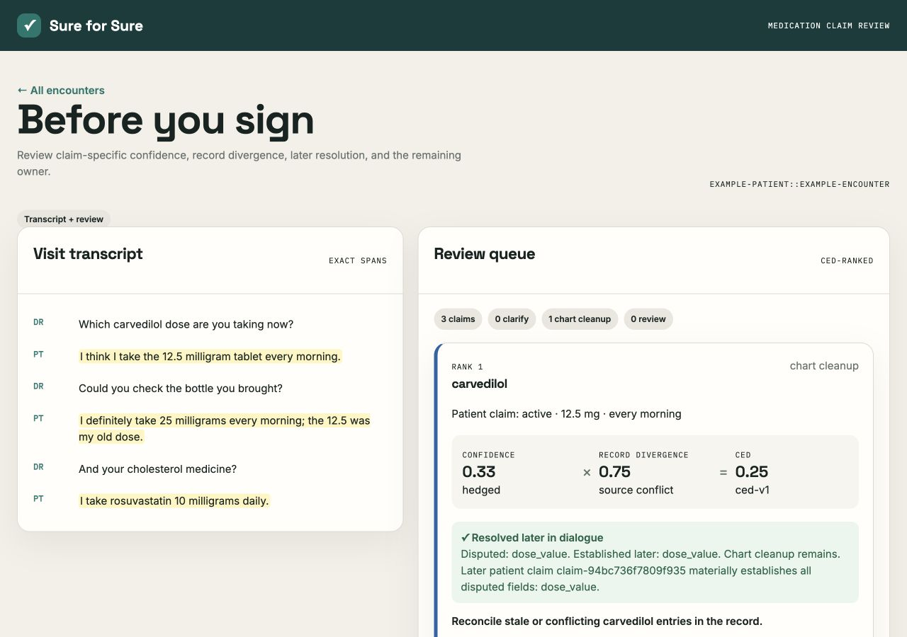

# Sure for Sure

Medication reconciliation fails in the gap between what a patient says and what the
record can actually establish. Sure for Sure turns each patient medication statement
into an inspectable claim, links it to same-patient FHIR evidence, compares every
asserted field, detects later clarification, and routes the uncertainty that remains.

Originally conceived during a healthcare AI hackathon, Sure for Sure was rebuilt from
the ground up as a tested, provenance-aware medication reconciliation and clarification
pipeline.



## End-to-end workflow

```text
transcript
  → exact patient claim + confidence
  → same-patient FHIR/longitudinal medication evidence
  → deterministic identity linking
  → field-level support / silence / contradiction / source conflict
  → CED attention score
  → disputed-field resolution from later patient speech
  → patient clarification, chart cleanup, clinician review, or no action
```

The authoritative runtime is the top-level [`pipeline/`](pipeline/) package, used by
both the [`backend/`](backend/) CLI/API and the [`frontend/`](frontend/) review app.
The ten explicit calls are visible in [`pipeline/runner.py`](pipeline/runner.py).

CED is deliberately simple:

```text
CED = patient-confidence signal × record-divergence signal
```

It is an attention heuristic, not a calibrated probability, clinical-risk score, or
assertion that the chart is more truthful than the patient. Record silence has an
explicit divergence contribution of `0.5`; it never becomes positive support, and the
UI shows both inputs beside the result.

## Evaluation

All 25 organizer-provided synthetic encounters were inspected. The checked-in
[`author-annotated evaluation set`](evaluation/organizer_medication_annotations.json)
contains 43 evaluable patient medication claims across 18 encounters, with exact
patient spans, structured fields, relevant record-evidence paths, and expected
relations. It is author-annotated engineering evaluation data—not independently
validated clinical ground truth.

The deterministic reasoning evaluation injects those reviewed claims at the provider
boundary, then runs the real normalization, FHIR extraction, linking, divergence, CED,
resolution, routing, and reporting stages:

| Measure | Result | Denominator |
|---|---:|---:|
| Medication normalization, conditioned on annotations | 100% | 43/43 claims |
| Evidence-link precision / recall / F1 | 1.00 / 1.00 / 1.00 | 38 TP, 0 FP, 0 FN |
| Divergence classification accuracy | 100% | 43/43 claims |
| Expected relation mix | 4 support, 36 silent, 3 source conflict | 43 claims |

The dataset contains no author-labeled direct-contradiction claim; deterministic unit
tests cover contradiction and competing-resource cases. The annotation guide and
machine-readable result are in [`evaluation/`](evaluation/).

Model-backed extraction precision, recall, F1, and field metrics were **not measured in
this environment**: `ANTHROPIC_API_KEY` and `SURE_FOR_SURE_ANTHROPIC_MODEL` were both
unset. The deterministic fixture is not presented as LLM output. Run the same evaluator
with `--provider anthropic` when credentials are available.

```bash
python evaluation/evaluate.py \
  --dataset /path/to/synthetic-ambient-fhir-25.jsonl \
  --provider anthropic \
  --output /tmp/anthropic-evaluation.json
```

## Quick Start

Requires Python 3.11+.

```bash
python -m pip install -e '.[dev]'
sure-for-sure analyze \
  --input examples/input.example.json \
  --index 0 \
  --provider stub \
  --output /tmp/sure-for-sure-output.json
```

The public example is independently authored, organizer-schema compatible, and uses a
clearly labeled fixture-backed extraction for reproducibility. Its committed
[`output`](examples/output.example.json) passes the complete product runtime and shows:

```text
"I think I take the 12.5 milligram tablet every morning."
  claim: carvedilol · active · 12.5 mg · every morning · hedged
  record: competing 12.5 mg and 25 mg entries
  relation: source_conflict
  CED: 0.33 × 0.75 = 0.2475
  later resolution: dose_value established as 25 mg
  route: chart_cleanup
  action: reconcile stale or conflicting carvedilol entries
  provenance: exact transcript span + record paths + source hashes
```

For live transcript extraction:

```bash
export ANTHROPIC_API_KEY=...
export SURE_FOR_SURE_ANTHROPIC_MODEL=<model-name>
sure-for-sure analyze \
  --input /path/to/encounters.jsonl \
  --index 0 \
  --provider anthropic
```

Missing credentials or an invalid provider response fail clearly; the CLI does not
silently replace model extraction with a zero-claim stub.

## API and review UI

```bash
export SURE_FOR_SURE_DATASET="$PWD/examples/input.example.json"
export SURE_FOR_SURE_PROVIDER=stub
uvicorn backend.main:app --host 127.0.0.1 --port 8000
```

In another terminal:

```bash
cd frontend
pnpm install --frozen-lockfile
pnpm dev
```

Open `http://127.0.0.1:5173`. The UI consumes the current API schema and displays exact
quotes, structured claims, linked evidence, field comparisons, disputed/resolved
fields, all CED inputs, routing rationale, recommended action, and provenance.

Verified API behavior:

- `GET /api/health` → 200
- `GET /api/encounters` → 200
- `POST /api/analyze/{record_id}` → 200 with three example claims
- unknown record → 404
- malformed analysis body → 422

## Verification

```bash
python -m pytest --cov=backend --cov=pipeline --cov-report=term-missing -q
python -m pytest tests/acceptance -q
python -m ruff check .
python -m mypy backend pipeline tools
python -m compileall -q backend pipeline tools
cd frontend && pnpm run build
```

Current local result: 81 tests pass, including 16 acceptance tests against the real
runtime; branch-aware coverage for `backend/` + `pipeline/` is 87%; Ruff and strict
mypy pass; the React/Vite production build succeeds.

## Repository map

```text
pipeline/    Typed models and the single ten-stage product workflow
backend/     JSON/JSONL repository, CLI, and FastAPI routes
frontend/    React/Vite clinician review interface
evaluation/  Annotation guide, 25-record claim set, evaluator, and measured result
examples/    Reproducible fixture-backed public input/output
tools/       Input validation and public-artifact integrity utilities
tests/       Unit, integration, regression, and acceptance coverage
docs/        Screenshot and supporting design documentation
```

The organizer dataset remains local and Git-ignored; only concise annotated claim spans
and evidence references are committed. Source and record SHA-256 hashes remain part of
every production report.

Repository-authored code is released under the [MIT License](LICENSE). That license does
not license or relicense the organizer-provided dataset or other third-party material;
the full organizer dataset remains excluded from the public repository.
